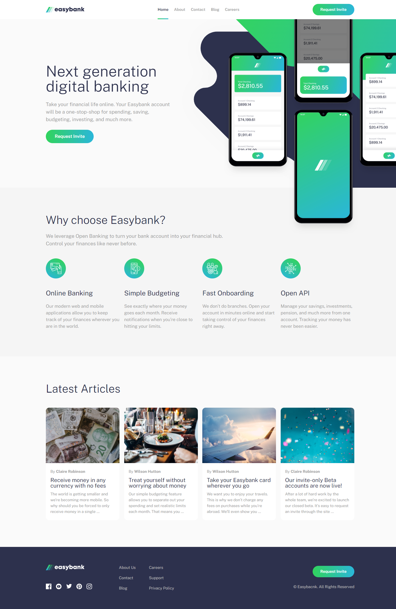
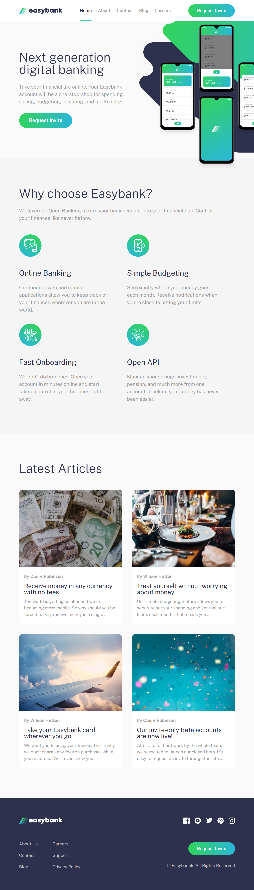
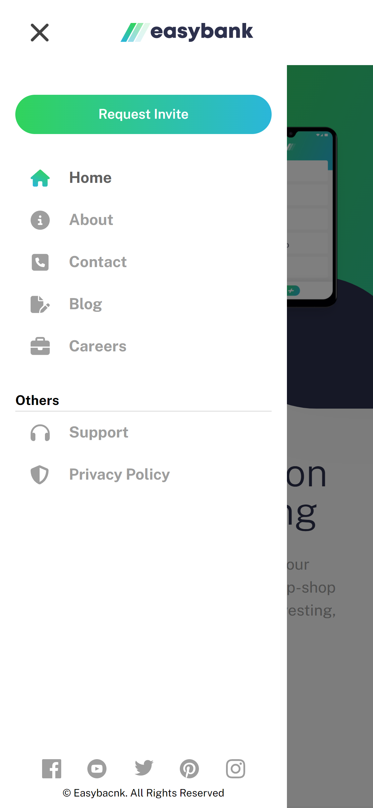

# Frontend Mentor - Easybank landing page solution
This is a solution to the [Easybank landing page challenge on Frontend Mentor](https://www.frontendmentor.io/challenges/easybank-landing-page-WaUhkoDN). Frontend Mentor challenges help you improve your coding skills by building realistic projects. 

## Table of contents
- [Overview](#overview)
  - [The challenge](#the-challenge)
  - [Screenshot](#screenshot)
  - [Links](#links)
- [My process](#my-process)
  - [Built with](#built-with)
  - [What I learned](#what-i-learned)
  - [Useful resources](#useful-resources)

## Overview

### The challenge
Users should be able to:

- View the optimal layout for the site depending on their device's screen size
- See hover states for all interactive elements on the page

### Screenshot
<table>
  <tr>
    <td valign="top">
        Desktop
        
    </td>
    <td valign="top">
        Tablet
        
    </td>
    <td valign="top">
        Phone
        
    </td>
    <td valign="top">
        Phone
        
    </td>
  </tr>
</table>

### Links
- [Live Demo](https://njvs.github.io/easybank-landing-page/)

### Built with
- Semantic HTML5 markup
- CSS custom properties
- Javascript
- [React](https://reactjs.org/) - JS library
- [SASS/SCSS](https://sass-lang.com) - CSS preprocessor
- Flexbox
- CSS Grid
- Responsive Web Design

### What I learned
I have nothing to say about this challenge tbh. I know using ReactJS for this challenge is a bit overkill but I'm still practicing so yeah. I'm currently trying out NextJs and Vite, and planning to use it for my future challenge here at FEM.

### Useful resources
- [A Complete Guide to Flexbox](https://css-tricks.com/snippets/css/a-guide-to-flexbox/)
- [A Complete Guide to Grid](https://css-tricks.com/snippets/css/complete-guide-grid/)
- [An opinionated styleguide for writing sane, maintainable and scalable Sass.](https://sass-guidelin.es/)
- [Javascript.info](https://javascript.info) - From the basics to advanced topics with simple, but detailed explanations.